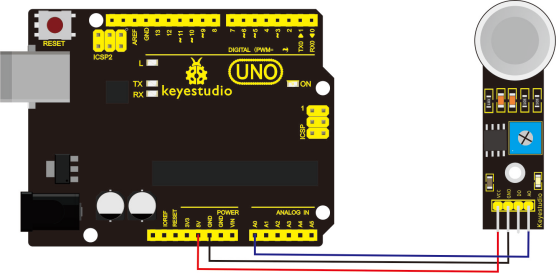
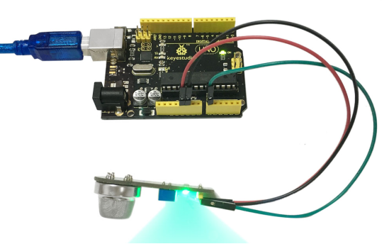

# KS0042 keyestudio MQ-4 Gas Sensor


## 1. Introduction

MQ-4 can be used in household and industrial-level gas leakage detection device to detect natural gas and methane.

It is featured with wide detection range, high sensitivity, fast response and recovery time, with excellent stability, long service life and simple drive circuit. Applicable gas: natural gas, methane.

## 2. Specification

- Detection Range: 300 ~ 10000ppm
- Characteristic Gas: 5000ppm methane
- Sensitivity: R in air/R in typical gas≥5
- Resistance of Sensitive Material: 1KΩ～20KΩ in 5000ppm methane
- Response Time: ≤10s
- Recovery Time: ≤30s
- Heating Resistance: 31Ω±3Ω
- Heating Current: ≤180mA
- Heating Power: ≤900mW
- Heating Voltage: 5.0V±0.2V
- Measuring Voltage: ≤24V

**Working condition of MQ-4:**

- Environment Temperature: -20℃～+55℃
- Humidity: ≤95%RH
- Environment Oxygen Content: 21%

**Storage condition of MQ-4:**

- Temperature: -20℃～+70℃
- Humidity: ≤70%RH

## 3. Connection Diagram



## 4. Sample Code

Download Code：[Code](./Code.7z)

```
void setup()
{
    Serial.begin(9600); //Set serial baud rate at 9600 bps
}

void loop()
{
    int val;
    val=analogRead(0);//Read Gas value from analog 0
    Serial.println(val,DEC);//Print the value to serial port
    delay(100);
}
```

